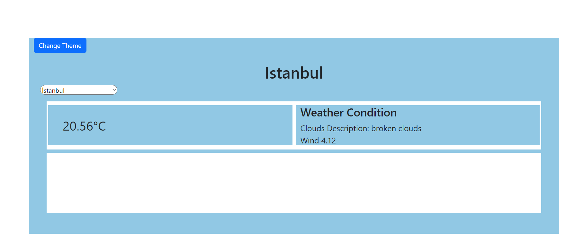
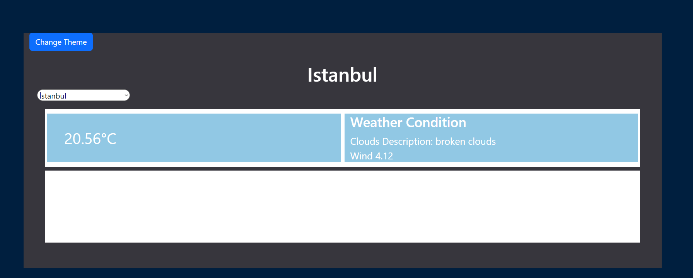

# Getting Started with Create React App

## Available Scripts

In the project directory, you can run:

### `npm start`

Runs the app in the development mode.\
Open [http://localhost:3000](http://localhost:3000) to view it in your browser.

The page will reload when you make changes.\
You may also see any lint errors in the console.

### `npm run build`

Builds the app for production to the `build` folder.\
It correctly bundles React in production mode and optimizes the build for the best performance.

The build is minified and the filenames include the hashes.\
Your app is ready to be deployed!

See the section about [deployment](https://facebook.github.io/create-react-app/docs/deployment) for more information.

## Project Description
1. `getCityWeather.js`:
   - This module uses the Axios library to make an API request.
   - It receives environmental variables such as `BASE_URL` and `KEY`.
   - It contains an asynchronous function called `getCityWeather`. This function calls an external API to retrieve weather information for a specific city.

2. `HomePage.js`:
   - This module includes a React component named `HomePage`.
   - This component provides a user interface where users can make selections from a list of cities and also displays weather information.
   - It utilizes `useContext` to enable data management. It creates a `Context` that shares weather information and theme mode.
   - It uses an asynchronous function called `fetchWeather` to fetch weather information for the selected city and updates this data in the component's state.
   - Users can change the theme by activating a button that allows theme switching.
   - It uses `useEffect` to apply theme changes and update the page's background color based on the selected theme.
   - It uses a dropdown list to allow users to change the selected city, which is used for fetching weather information.
   - Weather information is displayed on the page.

3. `Context.js`:
   - This module contains a React context and a provider function to facilitate context sharing.
   - It creates a context named `Context` and includes functions that provide access to two state variables: `weather` and `theme`.
   - The `ContextProvider` function is used to share this context among components.
## App Screenshots

### Light Theme 

### Dark Theme

